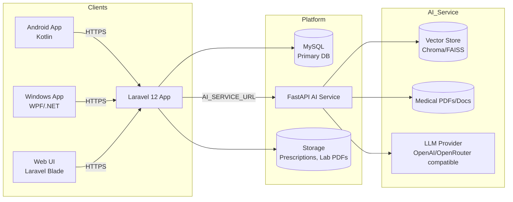
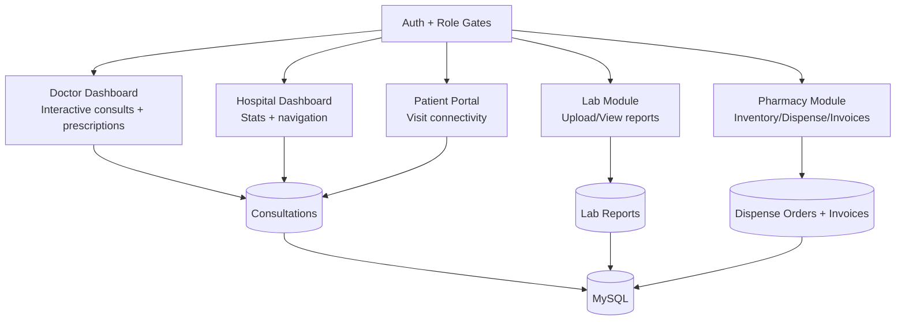

# MedAssist

MedAssist (formerly Niufin AI Doctor) is a comprehensive healthcare platform that integrates a mobile application, a robust backend management system, a native Windows desktop application, and an advanced AI service for medical data processing and consultation assistance.

## 🏗 Project Structure

The repository is organized into four main components:

- **`android_app/`**: The native Android mobile application built with Kotlin. It provides the user interface for patients and doctors to interact with the system.
- **`laravel_app/`**: The backend API and administrative dashboard built with Laravel 12. It handles user authentication, data management, prescriptions, visit connectivity, role-based portals, and integration with the AI service.
- **`python_service/`**: An AI-powered microservice built with FastAPI. It utilizes LangChain, ChromaDB/FAISS, and OpenAI-compatible models to provide RAG (Retrieval-Augmented Generation) capabilities, medical document analysis, and intelligent query responses.
- **`wpf_app/`**: The native Windows desktop application built with WPF and .NET 8, providing a seamless desktop experience for clinic staff.

## 🧭 System Architecture (High-Level)

### End-to-end structure



### Role portals in Laravel



## 🚀 Prerequisites

Before running the project, ensure you have the following installed:

- **General**: Git
- **Android**: Android Studio, JDK 17+
- **Backend**: PHP >= 8.2, Composer, Node.js & NPM, MySQL (or compatible SQL database)
- **AI Service**: Python 3.10+, Tesseract OCR (for PDF text extraction)

## 🛠 Installation & Setup

### 1. Clone the Repository
```bash
git clone https://github.com/niufin/Niufin-Doctor.git
cd Niufin-Doctor
```

### 2. Laravel Backend Setup
Navigate to the Laravel directory and install dependencies:
```bash
cd laravel_app
composer install
npm install && npm run build
```

Configure the environment:
```bash
cp .env.example .env
# Edit .env and configure your database settings (DB_DATABASE, DB_USERNAME, etc.)
php artisan key:generate
php artisan migrate --seed
```

### Create the first Super Admin

Normal user registration creates **patient** accounts only. To access the Super Admin dashboard, you must create (or promote) a user with `role=super_admin`.

**Option A (recommended for MySQL): create super admin via command**

```bash
php artisan db:restore-mysql --super-admin-email="you@example.com" --super-admin-password="StrongPassword" --skip-medicines
```

**Option B (any DB): promote an existing user via tinker**

```bash
php artisan tinker
>>> $u = App\Models\User::where('email', 'you@example.com')->first();
>>> $u->role = App\Models\User::ROLE_SUPER_ADMIN;
>>> $u->status = App\Models\User::STATUS_ACTIVE;
>>> $u->email_verified_at = now();
>>> $u->save();
```

Start the development server for local development:
```bash
php artisan serve
```

For production on a Windows server, Laravel is typically hosted behind IIS or Apache with PHP configured. The included `laravel_app/public/web.config` is tuned for IIS with HTTPS redirection and routing all requests to `index.php`.

### 3. Python AI Service Setup
Navigate to the Python service directory:
```bash
cd python_service
```

Create a virtual environment (optional but recommended):
```bash
python -m venv venv
# Windows
.\venv\Scripts\activate
# Linux/Mac
source venv/bin/activate
```

Install dependencies:
```bash
pip install -r requirements.txt
```

Configure the environment:
Create a `.env` file in `python_service/` and add the following keys:
```ini
OPENAI_API_KEY=your_openai_key
OPENROUTER_API_KEY=your_openrouter_key (if applicable)
TESSERACT_PATH="C:\Program Files\Tesseract-OCR\tesseract.exe" (adjust path as needed)
CHROMA_DB_DIR=./chroma_db
PDF_DIR=./pdfs
```

Start the API service for local development:
```bash
# Assuming api.py is the entry point, or use uvicorn
python api.py
# OR
uvicorn api:app --reload
```

On the Windows server, the AI service is managed via PowerShell helper scripts in `python_service/scripts`:

- `start-ai.ps1`: activates the dedicated `venv_new` environment and starts the FastAPI service on the configured host and port.
- `register-ai-task.ps1`: registers a scheduled task so the AI service starts automatically on server boot and restarts if it crashes.

### 4. Android App Setup
1.  Open **Android Studio**.
2.  Select **Open an existing project** and choose the `android_app` directory.
3.  Allow Gradle to sync and download dependencies.
4.  Create a `keystore.properties` file in `android_app/` if you plan to sign the app (refer to `build.gradle.kts` for required fields).
5.  Build and run the app on an emulator or physical device.

## 🔑 Key Features

* **AI Consultation**: Uses RAG to answer medical queries based on indexed PDFs and medical databases. Includes real-time indexing status surfaced on the doctor dashboard.
* **Prescription Management**: Generate, save, and print PDF prescriptions directly from the doctor dashboard. Pharmacists can view prescriptions and mark fulfillment status.
* **Lab Workflow**: Lab assistants can view prescriptions, upload lab reports, and see clear Pending/Report Uploaded statuses.
* **Pharmacy Inventory**: Batch-level stock management with rack location tracking.
* **Medical Document Analysis**: OCR and text extraction from uploaded medical reports.
* **Role-Based Access**: Separate portals for Doctors, Pharmacists, Lab Assistants, Patients, and Hospital Admins, with visit connectivity between patient accounts and past consultations.
* **Contact & Support**: Dedicated Contact Us page with direct WhatsApp integration (+91 33690 28316) for immediate support.

## 🧾 AI Prescription Generation (How it works)

- **End Consult** generates the final clinical summary and also asks the AI for a structured prescription JSON.
- The app stores the structured JSON into `consultations.prescription_data`, and the **Edit Prescription** screen uses that structure.
- PDF generation uses `prescription_data` when available, even if a final AI narrative is not present.
- Final diagnosis + prescription generation considers **primary intake symptoms** plus **secondary symptoms captured across the full chat**.
- The system is designed to be **non-creative** for prescriptions (deterministic AI settings + server-side validation/guardrails) so clearly-indicated symptom relief is not omitted.

### AI determinism (production expectation)

- The AI service is configured for non-creative output (typically `temperature=0`, `top_p=1`) to keep prescriptions consistent and repeatable.
- The Laravel backend applies additional server-side guardrails (validation, dedupe, and removal of unsafe/vague meds) so the UI is always working with a safe structured prescription object.

## 💊 Pharmacy Catalog Import (CSV)

The project supports importing a large medicine catalog (including ingredient compositions and pack pricing) from:

- `C:\\Users\\Sultan\\Downloads\\indian_pharmaceutical_products_clean.csv`

### Convert CSV → JSON only (no DB writes)
```bash
php artisan pharmacy:import-csv --path="C:\Users\Sultan\Downloads\indian_pharmaceutical_products_clean.csv" --output=storage/catalog/csv_only.json --no-db
```

### Import into DB + produce JSON/anomaly reports
```bash
php artisan pharmacy:import-csv --path="C:\Users\Sultan\Downloads\indian_pharmaceutical_products_clean.csv" --output=storage/catalog/csv_import_full.json --anomalies=storage/catalog/anomalies_full.csv
```

Imported data is mapped into normalized tables:
- `medicines.source_product_id` (source product id)
- `ingredients` + pivot (composition strengths)
- `packages.price_inr` / `packages.mrp` (pricing)
- `medicines.is_discontinued` (status)

## 📦 Pharmacy Inventory & Rack Locations

The system now supports granular inventory management:
- **Batch-Level Tracking**: Medicines are tracked by specific batches (Stock In), each with its own expiry date and quantity.
- **Rack Locations**: Each batch can be assigned a specific rack location (e.g., "Shelf A-1") during Stock In.
- **Dispensing Visibility**: Pharmacists can see the exact rack location of the batch being dispensed directly on the Dispense page.
- **Inventory View**: The main inventory list aggregates all rack locations for a medicine, making it easy to find where stock is stored.

## 📊 Current Project Status

The project is in an active development phase with the following recent updates:

- **Rebranding**: Renamed the application to **MedAssist** across all platforms (Android, Web, Windows).
- **Windows App**: Released a native Windows MSI installer (v1.4.0.0) built with Wix Toolset and .NET 8.
- **Android App**: Updated target API to 35 (Android 15) and prepared v1.4 release with comprehensive release notes.
- **Support**: Added a "Contact Us" page with WhatsApp integration.
- **Infrastructure**: Hardened the AI service startup on Windows using dedicated PowerShell scripts and a `venv_new` virtual environment.
- **Dashboard**: Added real-time indexing status from the AI service to the doctor dashboard.
- **Workflow**: Extended lab and pharmacy workflows with View Prescription actions and clear lab report statuses.
- **Database**: Updated schema to allow multiple consultations per patient (MRN not unique per consultation).
- **Pharmacy**: Added full CSV-based pharmacy catalog ingestion.
- **Pharmacy Inventory**: Moved rack location tracking to stock batches for granular location management per batch.
- **Hospital Admin**: Added Hospital Dashboard navigation, hospital-scoped consultation history, and prescription editing access.
- **Lab**: Extended Lab access to Hospital Admins (hospital-scoped), so the hospital can view/upload/manage reports.
- **History Sync**: Enabled the Patient History **Sync** action wherever Patient History access is granted (scoped to the user’s hospital/visibility).
- **Safety**: Test/migration safety hardening so automated tests cannot wipe MySQL unintentionally.

## ⚙️ Operations (Prod Server)

- **Restart AI service safely**
  - Preferred: use the **Restart AI** button in the Laravel admin/system UI, which internally calls the `start-ai.ps1` script and performs health checks.
  - Shell alternative (from repo root on the Windows server):
    ```powershell
    cd python_service\scripts
    .\start-ai.ps1 -AIHost 127.0.0.1 -AIPort 8002
    ```
  - **Auto-start + auto-restart options (Windows)**:
    - Scheduled Task + watchdog loop: `register-ai-task.ps1` / `register-ai-task-startup-admin.ps1` runs `run_doctorbrain.ps1` at boot (and restarts uvicorn if it crashes).
    - Windows Service (NSSM): `install-nssm-service.ps1` installs a service that runs the same watchdog runner.

- **AI logs location**
  - Rotating log files: `python_service/service_log-*.txt` (or OS temp fallback if the primary log directory is not writable)
  - NSSM service logs (if installed): `%ProgramData%\MedAssistAI\logs\nssm_stdout.log` and `nssm_stderr.log`

## 🔧 Configuration Notes

- **Laravel → AI service URL**
  - Set `AI_SERVICE_URL` in `laravel_app/.env`.
  - Config default is `http://127.0.0.1:8001`, but production Windows deployments commonly run the AI service on `http://127.0.0.1:8002` (match whatever `start-ai.ps1` / your service uses).
- **Python AI service secrets**
  - Put `OPENROUTER_API_KEY` (or `OPENAI_API_KEY`) in `python_service/.env`. The FastAPI service loads it via `python-dotenv`.
  - The AI service is configured for deterministic output (temperature=0, top_p=1) to keep prescriptions non-creative and repeatable.

## 🧪 Testing & Database Safety

- **Tests use SQLite**, not MySQL, to avoid accidental data loss when running `RefreshDatabase`.
- Prefer running the safe wrapper:
  - `cd laravel_app && php artisan safe:test`
- **Destructive DB commands are blocked by default** on non-SQLite connections unless explicitly overridden via `ALLOW_DESTRUCTIVE_DB_COMMANDS=true`.
- If MySQL data ever needs to be re-seeded (super admin + medicines CSV), use:
  - `cd laravel_app && php artisan db:restore-mysql --csv-path="C:\Users\Sultan\Downloads\indian_pharmaceutical_products_clean.csv"`

## 📦 Android Release Process

To reproduce the signed release APK:

1. Ensure `keystore.properties` in `android_app/` is configured with your signing config.
2. From the `android_app` directory, run:
   ```bash
   ./gradlew assembleRelease
   ```
3. The release APK will be generated under `android_app/app/release/` (e.g. `app-release.apk`).

## 📄 License

This project is open-sourced software licensed under the [MIT license](https://opensource.org/licenses/MIT).
